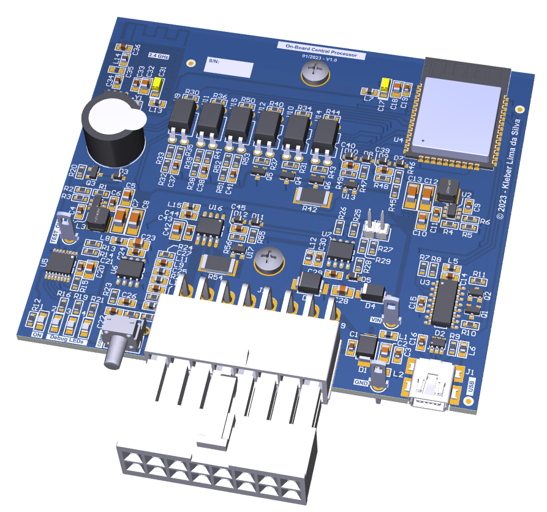

# On-Board Central Processor (OCP)

This repository is part of the [**myCar**](https://github.com/krebyy/myCar) project.

This is the module responsible for centralizing the information from all the other modules and communicating with the Human Mmachine Interface (HMI).

----
## Features
* Main and central processes
* Integration of modules
* Start/stop
* Parking brake

----
## Preview - PCB 3D
